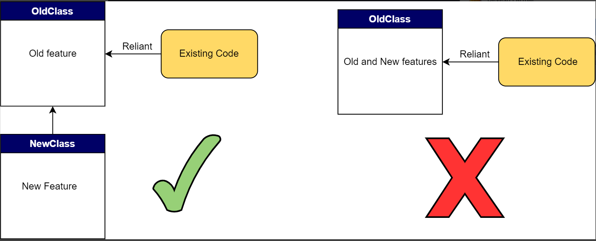

## SOLID PRINCIPLES

#### O -> Software Entities should be Open for Extension, Close for Modification

#### Achieved with Polymorphism and Abstraction.

#### The open-closed principle (OCP) calls for entities that can be widely adapted but also remain unchanged.This leads us to create duplicate entities with specialized behavior through polymorphism.

#### The advantage of OCP is that it minimizes program risk when we add new uses for an entity.Instead of reworking the base class to fit a work-in-progress feature, we create a derived class separate from the classes currently present throughout the program.

### Analogy
Questions (Creating new question type - (MCQ, Blank))

Notifications (Creating new Notification type - (Email, SMS))

